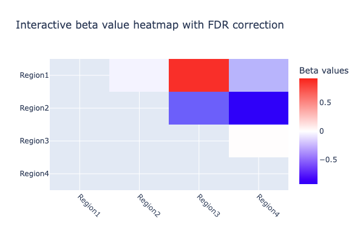

# CWAS4fMRI
This project was initialized during BrainHack School Montreal 2025. To see the original repo: https://github.com/brainhack-school2025/elkhantour_project

## Tools
This project uses the following tools and standards to ensure reproducibility, openness, and long-term usability:
- **Python scripts** : To write functions, modules and be able to test them
- **Git & GitHub**: 
   - *Public repo*: Enables version control and promotes open-source, collaborative development of the library.
   - *GitHub Actions*: Implements automated testing and continuous integration to maintain code quality during development (Git Actions).
- **BIDS Ecosystem**: Ensures compatibility with the BIDS standard, following the workflow of a BIDS App ([4](https://doi.org/10.1371/journal.pcbi.1005209)).
    - For this package, we followed the [BEP-017 proposal](https://bids.neuroimaging.io/extensions/beps/bep_017.html)
- **Python Packaging with uv**: Distributes the tool as an installable open-source Python library for easy integration and reuse.
- Interactive documentation : Provides runnable examples directly on the website for users to test and explore.
   - **Jupyter Notebooks**
   - **Plots with Plotly**
   - **Website with MyST**

#### Quick start
To run this pipeline, you simply need to follow the next 3 steps: 

1. Clone the repository
```
git clone https://github.com/brainhack-school2025/elkhantour_project.git
```
2. Install the package

```
pip install .
```

3. Run the pipeline using the command `cwas-rsfmri` followed by the flags.

```bash
cwas-rsfmri --bids_dir=bids_directory --output_dir=results --atlas_file=atlas.txt --atlas=example_atlas --phenotype_file=participants.tsv --group=diagnosis --case_id=NDD --control_id=HC --session=timepoint1 --task=task01 --run=01 --feature=denoiseSimple
```

The documentation is available directly on the site https://brainhack-school2025.github.io/elkhantour_project/

To visualize the interactive figure, please see: https://brainhack-school2025.github.io/elkhantour_project/interactive-plots



### Contribution to Open Science
This project aims to:
1. Promote __collaborative science__ through:
- A public GitHub repository open to contributions
- Continuous integration with GitHub Actions, which automatically run on new pull requests from external users
2. Ensure __reproductible pipeline and results__ by:
- Providing a Python package that can be run with just three command-line commands
- Following the BIDS standard for input organization, aligning with community efforts to standardize neuroimaging workflows
3. Offer extensive __documentation__ using MyST markdown, a tool designed for open-source projects that supports clear, structured scientific communication and web-based publishing.

## Conclusion
This project provides an easy-to-use and fast Python package for researchers working with fMRI connectivity matrices. It's fully open-source and welcomes collaboration from the community.

The package was built using recent, open-source tools and follows principles established by the neuroimaging community—ensuring it aligns with current standards in neuroimaging research.

### Next steps
- **Expand integration tests**: Improve existing tests and add failing test cases to ensure the pipeline handles incorrect inputs and edge cases properly.
- **Publish to PyPi**: Once the pipeline is more stable and mature, release an official version to PyPI for easier installation and distribution.
- **Docker & Apptainer**: Containerize the pipeline to ensure full environment reproducibility using Docker and Apptainer.

### Brain Hack School presentation materials
[Project description - Week 2](https://docs.google.com/presentation/d/1BFQEd32ZGSvIpQaBQh5KjRjrZ0RL78illSvqR80Dr_E/edit?usp=sharing).

[Final presentation - Week 4](https://docs.google.com/presentation/d/1AT7jvhL63toRHIYBsFZYHyxpPp-cLphSkeC5kAkJMak/edit?usp=sharing).

## Aknowledgements
This library is based on code published by Dr. Clara A. Moreau & Dr. Sebastian Urchs.

The original version of the scripts can be found here : https://github.com/claramoreau9/NeuropsychiatricCNVs_Connectivity

Thanks to Sara & Cleo for their help to create the Myst website! I would like to thank all the Professors, TAs, speakers of Brain Hack School 2025. Special thanks to Lune Bellec who was mentoring me over the past few weeks.

## 📖 References
1. 	Botvinik-Nezer R, Wager TD. Reproducibility in neuroimaging analysis: Challenges and solutions. Biol Psychiatry Cogn Neurosci Neuroimaging. 2023;8: 780–788.
2. 	Thompson PM, Stein JL, Medland SE, Hibar DP, Vasquez AA, Renteria ME, et al. The ENIGMA Consortium: large-scale collaborative analyses of neuroimaging and genetic data. Brain Imaging Behav. 2014;8: 153–182.
3. 	Waller L, Erk S, Pozzi E, Toenders YJ, Haswell CC, Büttner M, et al. ENIGMA HALFpipe: Interactive, reproducible, and efficient analysis for resting-state and task-based fMRI data. Hum Brain Mapp. 2022;43: 2727–2742.
4. 	Gorgolewski KJ, Alfaro-Almagro F, Auer T, Bellec P, Capotă M, Chakravarty MM, et al. BIDS apps: Improving ease of use, accessibility, and reproducibility of neuroimaging data analysis methods. PLoS Comput Biol. 2017;13: e1005209.

